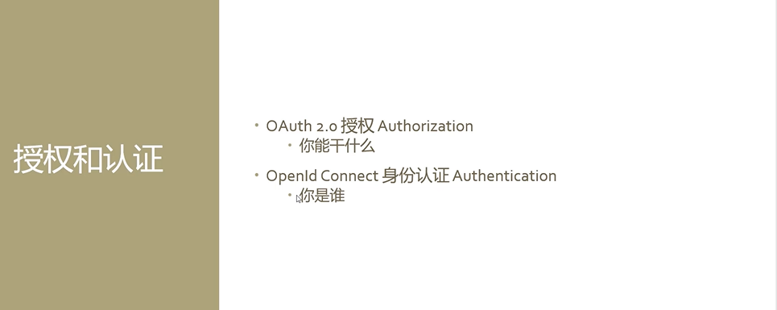
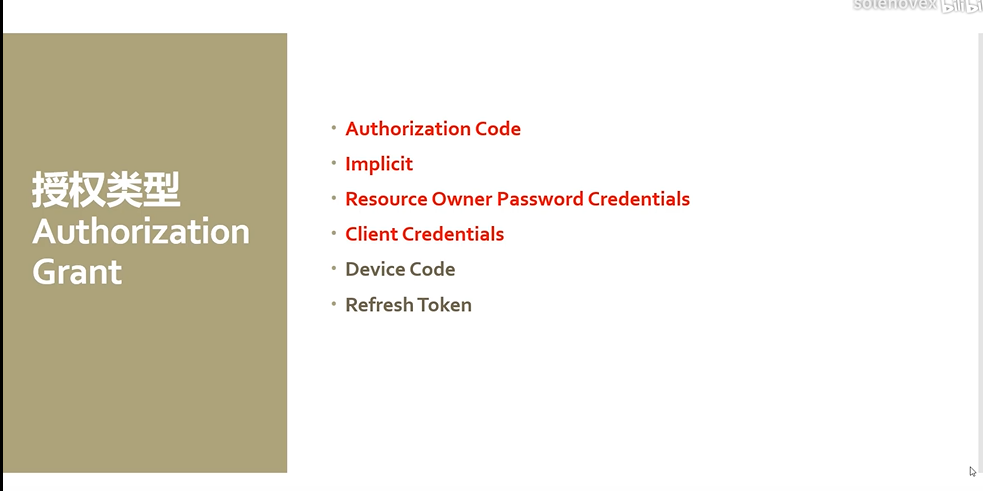
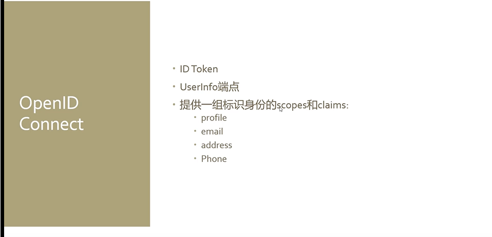
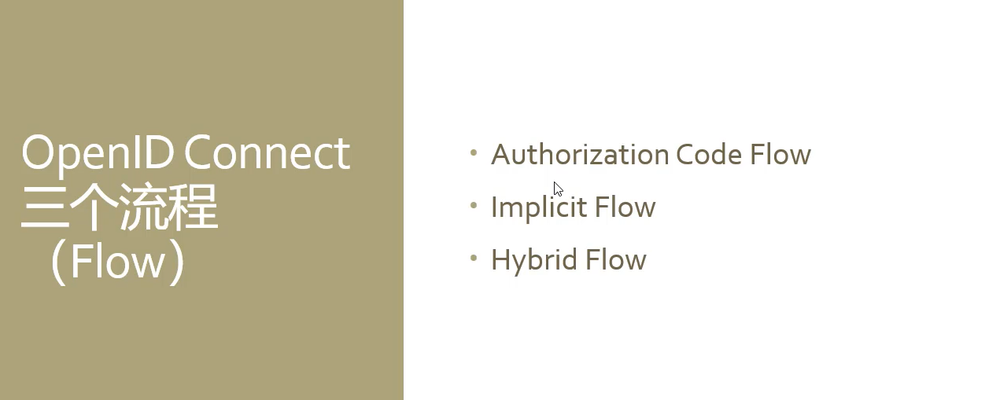
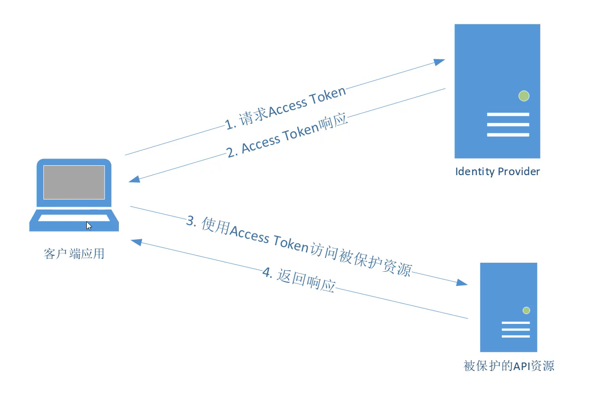

# OAuth2











# IdentityServer4

Authentication:身份验证; 认证；鉴定

Authorization:授权

## Client Credentials

客户端认证代码

```c#
  public void ConfigureServices(IServiceCollection services)
  {                       
      services.AddControllers();
      services.AddAuthentication("Bearer")
      .AddIdentityServerAuthentication(
          options =>
          {
              options.Authority = "http://localhost:5000"; //权限验证url
              options.RequireHttpsMetadata = false;//是否开启https
              options.ApiName = "api";
          });
      //services.AddAuthentication("Bearer")
      //    .AddJwtBearer("Bearer", options =>
      //    {
      //        options.Authority = "http://localhost:5000";
      //        options.RequireHttpsMetadata = false;
      //        options.Audience = "api";
      //    });

   }
```

```c#
 public void Configure(IApplicationBuilder app, IWebHostEnvironment env)
 {
     if (env.IsDevelopment())
     {
     	app.UseDeveloperExceptionPage();
     }

    app.UseHttpsRedirection();
    app.UseRouting();

    app.UseAuthentication();//认证  必须放在授权前面，否则无效
    app.UseAuthorization();//授权

    app.UseEndpoints(endpoints =>
    {
    	endpoints.MapControllers();
    });
}
```

**注意点：app.UseAuthentication()必须放在app.UseAuthorization()  (认证必须放在授权的前面)**




客户端授权认证代码：

```c#
static async Task Main(string[] args)
{
    //Console.WriteLine("Hello World!");
    // 从元数据中发现端口
    // 调用API
    var client = new HttpClient();
    var disco = await client.GetDiscoveryDocumentAsync("http://localhost:5000");
    // 请求以获得令牌

    var tokenResponse = await client.RequestClientCredentialsTokenAsync(
    new ClientCredentialsTokenRequest()
    {
        Address = disco.TokenEndpoint,
        ClientId = "client",
        ClientSecret = "secret",
        Scope = "api"
    });

    if (tokenResponse.IsError)
    {
        Console.WriteLine(tokenResponse.Error);
        return;
    }

    Console.WriteLine(tokenResponse.Json);

    client.SetBearerToken(tokenResponse.AccessToken);

    var response = await client.GetAsync("http://localhost:5002/WeatherForecast");
    if (!response.IsSuccessStatusCode)
    {
    	Console.WriteLine(response.StatusCode);
    }
    else
    {
        var content = await response.Content.ReadAsStringAsync();
        Console.WriteLine(JArray.Parse(content));
    }

}
```

[项目代码]: https://github.com/thr828/IdentityServer4	"IdentityServer4"


# .NET项目迁移到.NET Core操作指南

地址:http://www.10qianwan.com/articledetail/430496.html


# asp.net core系列 Identity介绍

地址：https://www.jianshu.com/p/5464f2ef7a6f


# 精彩文章

https://www.cnblogs.com/jesse2013/

http://www.jessetalk.cn/

# 参考

参考github：https://github.com/solenovex/Identity-Server-4-Tutorial-Demo-Code

​					 https://www.bilibili.com/video/BV16b411k7yM?p=1


# Redis、Memcached、Kafka、RabbitMQ

## 1.RabbitMQ


# Vue、Angular、EasyUi